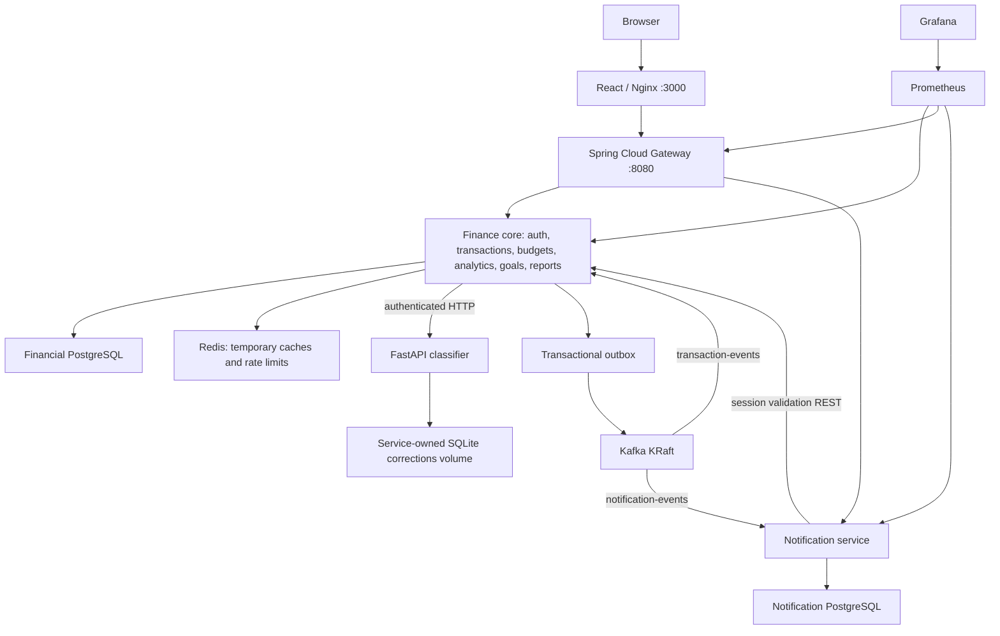
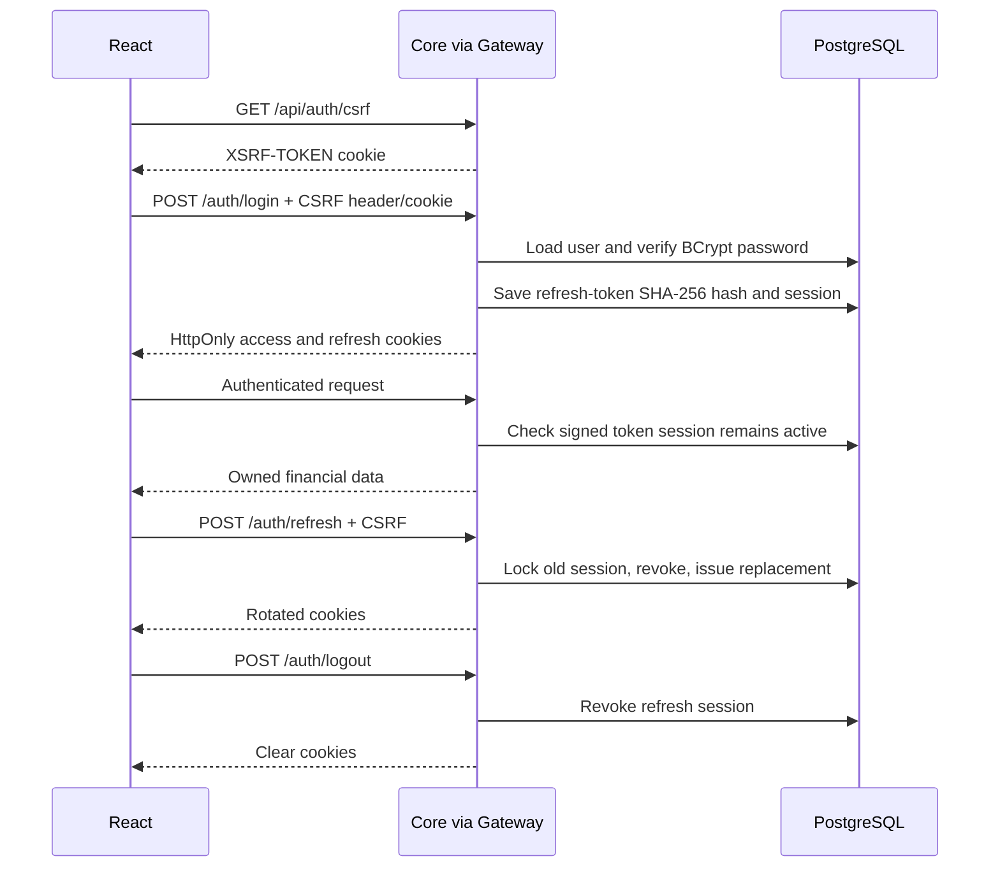
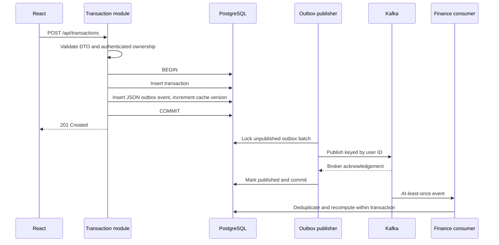
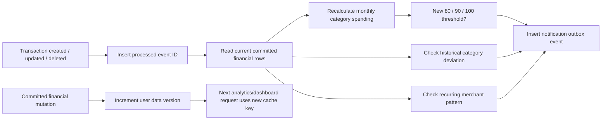
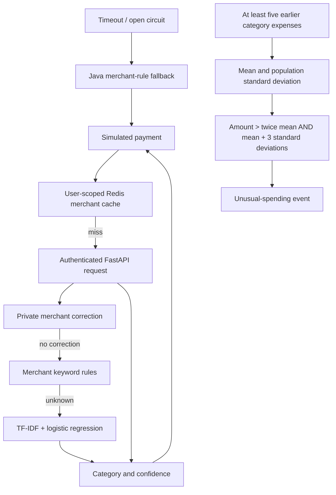
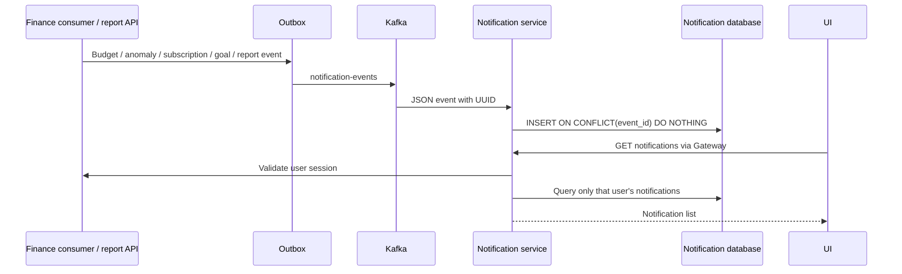

# SpendWise project flows

## Deployment architecture

## Login, refresh and logout

Tokens default to 15-minute access and 14-day refresh lifetime. Reuse of a revoked refresh token revokes all sessions for that account. Redis is not the authority for revocation.

## Transaction creation and Kafka

Wallet simulation additionally locks the wallet row and stores the response under a client-generated idempotency key. A duplicate key with the same payload returns the original response; a different payload returns 409.

## Budget and analytics updates

Budget usage is calculated, not a mutable counter. Redis entries expire after 60 seconds. Cache keys include user ID, period and a database version, so committed transaction changes cannot continue serving an earlier version.

## AI categorization and anomalies

Corrections are stored by user and normalized merchant. They never retrain the shared classifier.

## Notifications and reports

Notifications use 15-second polling. Reports use calculated data and support browser Print / Save as PDF. No external messages are sent.

